# Supabase Edge Functions Secrets & Flow Diagram

This document contains a comprehensive list of all secrets/environment variables used by the Paris Exchange edge functions, along with a visual representation of how data flows between the database, triggers, and edge functions.

## Environment Variables/Secrets

Here's a list of all the secrets and environment variables used by your edge functions:

### Email-related Secrets
| Secret Name | Description | Used In |
|-------------|-------------|---------|
| `SMTP_HOST` | SMTP server hostname | All email sending functions |
| `SMTP_PORT` | SMTP server port (typically 465) | All email sending functions |
| `SMTP_USER` | SMTP username/email address | All email sending functions |
| `SMTP_PASS` | SMTP password | All email sending functions |
| `FROM_EMAIL` | Sender email address | All email sending functions |

### Supabase Connection Secrets
| Secret Name | Description | Used In |
|-------------|-------------|---------|
| `SUPABASE_URL` | Supabase project URL | get-currencies, email-tracking, send-satisfaction-emails |
| `SUPABASE_SERVICE_ROLE_KEY` | Supabase service role key | get-currencies, send-satisfaction-emails |
| `SUPABASE_ANON_KEY` | Supabase anonymous key | email-tracking |

### API Keys and External Services
| Secret Name | Description | Used In |
|-------------|-------------|---------|
| `YODA_API_URL` | URL for the YODA currency data API | get-currencies |
| `YODA_API_KEY` | API key for the YODA service | get-currencies |
| `WEBSITE_URL` | Base URL of your website | handle-order-confirmed-email, send-satisfaction-emails |
| `ADMIN_URL` | URL for the admin dashboard | send-email-notification |
| `GOOGLE_REVIEW_URL` | URL for Google Business review page | send-satisfaction-emails |

### Hardcoded Secrets
The following secrets are hardcoded in database triggers and should be moved to environment variables:

| Secret | Where It's Used | Description |
|--------|----------------|-------------|
| `supabase_url` | In both trigger functions | Your Supabase project URL: "https://aipeozkfsbehyzdexmpk.supabase.co" |
| `anon_key` | In both trigger functions | Your Supabase anonymous key (JWT) - SENSITIVE |
| `recipient_email` | In notify_new_order function | Admin email: "haddad.nidal1@gmail.com" |

## Flow Diagram

```mermaid
graph TD
    %% Database and Triggers
    DB[(Supabase Database)] 
    
    %% Trigger definitions
    T1[Trigger: trigger_new_order]
    T2[Trigger: order_confirmed_email]
    
    %% Functions triggered by events
    F1[Function: notify_new_order]
    F2[Function: order_confirmed_email_notification]
    
    %% Edge Functions
    E1[Edge Function: send-email-notification]
    E2[Edge Function: handle-order-confirmed-email]
    E3[Edge Function: email-tracking]
    E4[Edge Function: get-currencies]
    E5[Edge Function: send-satisfaction-emails]
    
    %% External Services
    S1[SMTP Server]
    S2[YODA API Service]
    S3[Google Reviews]

    %% Customer and Admin
    U1((Customer))
    U2((Admin))
    
    %% Database Events and Triggers
    DB -->|INSERT on orders| T1
    DB -->|UPDATE on orders| T2
    T1 -->|Fires| F1
    T2 -->|Fires when status changes to 'confirmed'| F2
    
    %% Function calls to Edge Functions
    F1 -->|Invokes| E1
    F2 -->|Invokes| E2
    
    %% Scheduled Events
    CRON([Scheduled Job]) -->|Hourly| E4
    CRON2([Scheduled Job]) -->|Daily| E5
    
    %% Edge Function External Connections
    E1 -->|Sends admin notification| S1
    E2 -->|Sends customer confirmation| S1
    E4 -->|Fetches currency rates| S2
    E5 -->|Sends satisfaction emails| S1
    
    %% Data flows back to Database
    E4 -->|Updates currency data| DB
    E3 -->|Records email interaction| DB
    E5 -->|Updates satisfaction_email_sent flag| DB
    
    %% User Interactions
    U1 -->|Places order| DB
    U1 -.->|Opens/clicks email| E3
    U1 -.->|Provides rating| E3
    U1 -.->|High rating| S3
    U2 -->|Confirms order| DB
    U2 -.->|Receives notifications| E1

    %% Styling
    classDef database fill:#f9f,stroke:#333,stroke-width:2px;
    classDef trigger fill:#bbf,stroke:#33f,stroke-width:1px;
    classDef function fill:#bfb,stroke:#3f3,stroke-width:1px;
    classDef edge fill:#fbb,stroke:#f33,stroke-width:1px;
    classDef service fill:#ff9,stroke:#993,stroke-width:1px;
    classDef user fill:#9ff,stroke:#399,stroke-width:1px;
    classDef cron fill:#fcf,stroke:#939,stroke-width:1px;
    
    class DB database;
    class T1,T2 trigger;
    class F1,F2 function;
    class E1,E2,E3,E4,E5 edge;
    class S1,S2,S3 service;
    class U1,U2 user;
    class CRON,CRON2 cron;
```

## Detailed Flow Description

### Order Creation & Notification Flow
1. Customer places an order in the frontend application
2. Data is saved to the `orders` table with status "pending"
3. The `trigger_new_order` trigger fires, executing the `notify_new_order()` function
4. This function calls the `send-email-notification` edge function
5. The edge function sends an email to the admin with order details
6. The email-sending attempt is logged in the `email_logs` table

### Order Confirmation Flow
1. Admin confirms the order in the admin dashboard
2. The order status is updated from "pending" to "confirmed" in the database
3. The `order_confirmed_email` trigger fires, executing the `order_confirmed_email_notification()` function
4. This function calls the `handle-order-confirmed-email` edge function
5. The edge function sends a confirmation email to the customer with order details and pickup instructions
6. The email-sending attempt is logged in the `email_logs` table

### Email Tracking Flow
1. Customer opens the email or clicks on links within the email
2. These actions call the `email-tracking` edge function with specific parameters
3. The edge function records the interaction in the `email_tracking` table
4. For satisfaction emails, customer ratings are also recorded

### Currency Update Flow
1. A scheduled job runs the `get-currencies` edge function hourly
2. The function fetches current currency rates from the YODA API
3. The function updates the `currencies` table with the latest rates

### Customer Satisfaction Flow
1. A scheduled job runs the `send-satisfaction-emails` edge function daily
2. The function identifies completed orders that haven't yet received a satisfaction email
3. Satisfaction emails with rating options are sent to eligible customers
4. When a customer provides a rating, it's tracked via the `email-tracking` edge function
5. High ratings can direct customers to leave a Google review

## Security Recommendations

1. **Move hardcoded secrets to environment variables:**  
   The Supabase URL, anon key, and recipient email are currently hardcoded in database functions. These should be moved to secure environment variables.

2. **Rotate keys regularly:**  
   Implement a routine for rotating API keys and passwords, especially for external services.

3. **Implement more granular permissions:**  
   Use dedicated service accounts with minimal required permissions for each function.

4. **Add rate limiting:**  
   Implement rate limiting on your edge functions to prevent abuse.

5. **Enhanced logging and monitoring:**  
   Set up alerts for failed operations and implement more detailed logging.
